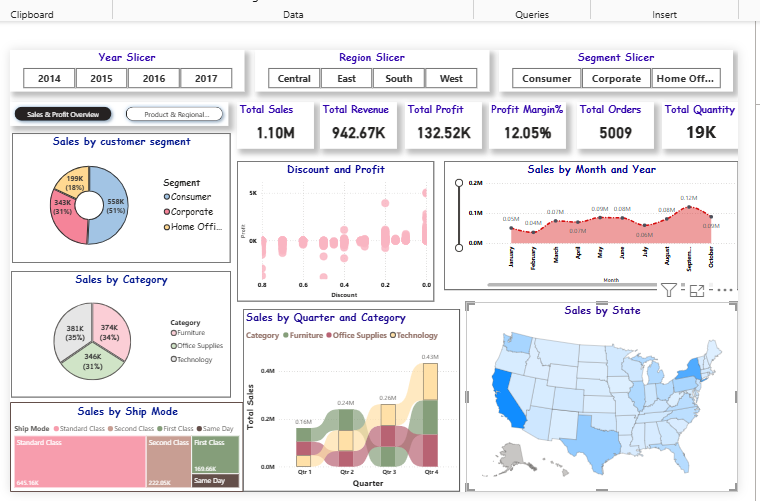
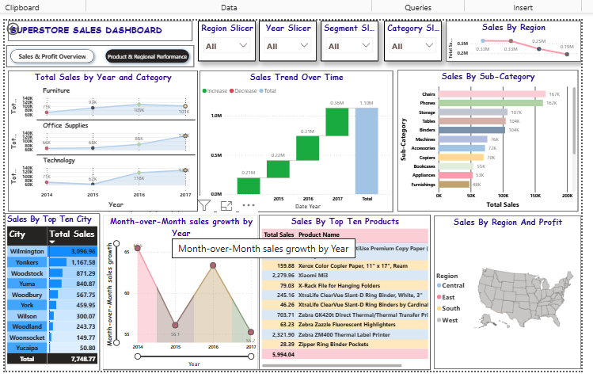

# 📊 Superstore Sales Dashboard — Power BI

An interactive, two-page Power BI dashboard built on the Superstore dataset — transforming raw retail transaction data into clear business insights on sales, profit, regional performance, and customer behaviour.

---

## 🖼️ Dashboard Preview

### Page 1 — Sales & Profit Overview

### Page 2 — Product & Regional Performance

---

## 📁 Repository Files

| File | Description |
|------|-------------|
| `final-dashborad-sales.pbix` | Power BI report file |
| `Sample - Superstore.csv` | Source dataset |
| `project1.png` | Screenshot — Sales & Profit Overview |
| `project2.png` | Screenshot — Product & Regional Performance |

---

## 📌 Dashboard Pages

### Page 1 — Sales & Profit Overview

| Visual | Description |
|--------|-------------|
| 📦 KPI Cards | Total Sales: **1.10M** · Revenue: **942.67K** · Profit: **132.52K** · Margin: **12.05%** · Orders: **5,009** · Quantity: **19K** |
| 🍩 Sales by Customer Segment | Consumer 51% · Corporate 31% · Home Office 18% |
| 🍩 Sales by Category | Technology 35% · Furniture 34% · Office Supplies 31% |
| 📊 Sales by Ship Mode | Standard Class leads, Same Day is lowest |
| 🔵 Discount vs Profit | Scatter plot showing how heavy discounting hurts margins |
| 📈 Sales by Month & Year | Seasonal trend line across all years |
| 📊 Sales by Quarter & Category | Q4 is consistently the strongest quarter |
| 🗺️ Sales by State | US filled map — West Coast and East Coast dominate |

### Page 2 — Product & Regional Performance

| Visual | Description |
|--------|-------------|
| 📊 Sales Trend Over Time | Waterfall chart: growth from **0.22M (2015)** to **1.10M (2017)** |
| 📉 Sales by Year & Category | Small multiples for Furniture, Office Supplies, Technology |
| 📊 Sales by Sub-Category | Chairs **167K** and Phones **162K** lead all sub-categories |
| 🔵 Sales by Region | West & East outperform Central & South |
| 🏙️ Top 10 Cities | Wilmington tops at **$3,096.96** |
| 📦 Top 10 Products | Xerox, Xiaomi, XtraLife products in top positions |
| 📈 Month-over-Month Growth | Trend line across 2014–2017 |
| 🗺️ Sales by Region & Profit | Map with regional profit overlay |

---

## 🎛️ Filters & Slicers

- **Year** — 2014 · 2015 · 2016 · 2017
- **Region** — Central · East · South · West
- **Segment** — Consumer · Corporate · Home Office
- **Category** — Furniture · Office Supplies · Technology

---

## 🔧 Tools & Technologies

| Tool | Usage |
|------|-------|
| **Power BI Desktop** | Report design & all visualizations |
| **DAX** | KPI measures — Profit Margin %, MoM Growth, Running Totals |
| **Power Query (M)** | Data cleaning & transformation |
| **Superstore CSV** | 4-year retail dataset (orders, categories, regions) |

---

## 💡 Key Insights

> **1.** Discounts above **40%** consistently produce **negative profit** — visible clearly in the scatter plot.

> **2.** **Q4** is the strongest quarter every year across all product categories.

> **3.** The **Consumer segment** drives over **half** of total revenue.

> **4.** **Technology** has the highest sales but is most sensitive to discount-driven margin erosion.

> **5.** **Chairs and Phones** are the top two sub-categories — strong targets for upselling strategy.

---

## 🚀 How to Run

1. Clone or download this repository
2. Open `final-dashborad-sales.pbix` in **Power BI Desktop**
3. If data source path breaks, redirect to `Sample - Superstore.csv` in Power Query
4. Hit **Refresh** — all visuals update automatically
5. Use the slicers to explore by year, region, segment, or category

---

## 👩‍💻 Author

**Ayesha Sana**  
[GitHub Profile](https://github.com/ayeshasana0355)
